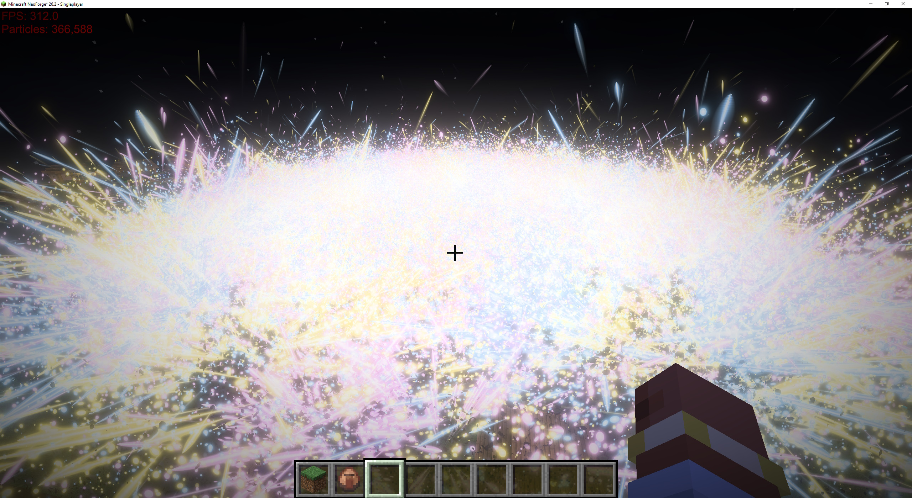

<div align="center">


Materials and shader graphs · GPU compute kernels · VFX and particle systems · Cinematic post-processing · A complete text engine

[](docs/ENGINE_API.md)
[](docs/SHADERS.md)
[](docs/BUILD.md)
[](docs/SETUP.md)
[](COPYING.LESSER)

</div>

---

Crystal Graphics brings modern GPU and graphics programming pipelines to Java: the render graph, compute-driven particles and HDR post
processing stacks and other advanced rendering pipelines that modern AAA engines are built on, in a library for your own LWJGL application or your Minecraft mod.
Write a material, play an effect or draw meshes into the world, and it runs on Vulkan where it can and on OpenGL 3.3
and up everywhere else.

Under the hood, each frame is recorded on any thread, built into a graph and executed once, and every feature reaches
the same result on either backend. The core names no Minecraft, loader or LWJGL type, and it ships for Minecraft as
**one jar** for every loader and version.

## Built for scale

> **Over 360,000 particles at a steady 300+ fps**, in Minecraft, on an RTX 4070 SUPER.

<p align="center">
  
  <br>
  <sub>366,588 GPU particles at 312 fps, simulated, sorted, culled and drawn via GPU compute kernels in Minecraft 26.2 on Vulkan.</sub>
</p>

The CPU describes the frame, and the GPU does the work.

<details>
<summary><b>How it gets there</b></summary>

- **Particles that never leave the GPU** — spawned, moved, collided, sorted, culled and drawn by compute kernels, and
  an event's children spawned there too; the CPU only schedules each emitter and hears back only what it asks for.
- **Multi-draw indirect and vertex pulling** — a whole particle system draws in one call per look, its quads built
  from the vertex index with no vertex buffers.
- **Zero-stall streaming** — persistently mapped upload memory, readbacks behind fences, one fence wait a frame and no
  allocation on hot paths.
- **Energy-conserving bloom** — a 13-tap downsample with Karis averaging and a tent upsample, its glow written in the
  same draw as the colour.

</details>

## Features

### Rendering

- **Render graph** — passes ordered by what they read and write, culled and batched into multi-draws, with barriers
  placed and transients pooled for you; async compute and a dedicated transfer queue on Vulkan.
- **GPU-driven drawing** — frustum and Hi-Z occlusion culling, compaction and radix sorting in compute; draws issued
  indirectly from counts the GPU wrote, LODs picked per draw.
- **World renderer** — meshes, labels and effects drawn into Minecraft's world, lit and fogged as its own blocks.
- **GL on Vulkan** — the engine's GL-shaped calls answered on a Vulkan device, so one code path drives both.

### Shading

- **Materials** — one `.shader` source for Vulkan and GL: keyword variants, emissive and distortion passes, depth modes.
- **Shader graph** — materials authored as node graphs, with live previews.
- **Compute** — `.compute` kernels that run as compute where it exists and as draws where it does not.

### Effects

- **HDR and post** — a linear HDR scene with physically based bloom, heat-haze distortion, flashes and anime impact frames.
- **VFX** — GPU particles built from module stacks, with events and collisions against the world and the scene's depth.
- **The world on the GPU** — the blocks round the camera as a voxel window with a jump-flood distance field, updated
  only where it changed: particles land, bounce and take their light from them.
- **Camera shake** — trauma, punches and FOV kicks an effect declares, summed into the host's camera.
- **Text** — MSDF glyphs generated off-thread, system font fallback, labels placed in the world.

### Platform

- **Every loader** — Forge 1.7.10–26.3, NeoForge 1.20.2–26.3 and Fabric 1.14.4–26.3, from one jar.
- **Off the render thread** — meshes, textures, glyphs and shaders built on workers, never on the frame.
- **Player settings** — quality tiers, particle density, HDR and a comfort setting for flashes, applied to every effect.
- **Networking** — typed messages, requests and replicated state between client and server.

### Tooling

- **Every tier, on your machine** — a kernel a Mac could not run fails on yours, naming the line; any tier can be forced.
- **Warm starts** — shaders prewarmed off the frame; on Vulkan, compiled shaders and the pipeline cache kept across launches.
- **Profiling** — CPU zones, GPU timestamps per pass and per material, an overdraw view.
- **Inspection** — a checked mode bounding every kernel access, and buffers decoded field by field from the GPU.

## Getting started

Add the repository and the API to your mod's `build.gradle.kts`:

```kotlin
repositories {
    maven("https://dl.cloudsmith.io/public/crystalgraphics/crystalgraphics/maven/")
}
dependencies {
    compileOnly("com.crystalgraphics:core:0.0.1")
}
```

Players install Crystal Graphics as a mod of its own, and yours depends on it. The dev run, your mod's descriptor and
one jar for several loaders are all in [Setup](docs/SETUP.md).

## At a glance

Draw a glass sphere into the world:

```java
CgWorldRenderer world = CgWorldRenderer.get();
CgMaterial glass = CgMaterial.load("mymod:shaders/glass.shader");
glass.applyProperties(p -> p.vec4("_Tint", 1.0f, 0.5f, 0.8f, 0.4f));   // pink glass instead of blue

world.onFrame(view -> world.draw(CgMeshShapes.sphere(24, 32), glass).at(x, y, z).submit());
```

The material it draws with:

```glsl
// A transparent glass material with a tint
#type spatial                                   // Meshes with an XYZ position, UV and normal per vertex
Tags { "RenderType" = "Transparent" }           // see-through, so it casts no shadow
Queue = "Transparent"                           // drawn after solid things, back to front

Properties {                                    // values the game can set (applyProperties above)
    _Tint ("Tint", color) = (0.6, 0.85, 1.0, 0.4)   // pale blue, 40% opaque, unless set otherwise
}

Pass {
    RenderState {
        Blend SRC_ALPHA ONE_MINUS_SRC_ALPHA     // mix over what is behind by the colour's alpha
        DepthWrite OFF                          // never hide what is drawn behind it later
    }
    struct v2f { vec2 uv; };                    // what the vertex stage hands the fragment stage

    void vertex(out v2f o) {                    // once per vertex
        o.uv = cg_TexCoord0;                    // pass the mesh's UV along
        gl_Position = CG_MATRIX_MVP * vec4(cg_Position, 1.0);   // place it on screen
    }

    void fragment(in v2f i, out vec4 fragColor) {   // once per pixel
        fragColor = _Tint;                      // the tint, lit by the world's light after
    }
}
```

Fire a Kamehameha, then flash the screen around where it lands:

```java
CgVfxSystem vfx = new CgVfxSystem();
CgEnergyWave beam = vfx.play(new CgEnergyWave(CgEnergyWave.kamehameha(), x, y, z));   // fire from x, y, z
beam.aim(dx, dy, dz);                                                                 // in this direction

CgPostSettings bright = new CgPostSettings().flash(1.5f);       // brighten the picture (1 doubles it)
CgPostVolume flash = CgPostStack.get().volume(10, bright);     // apply it now; 10 wins over lower-priority effects
flash.at(hitX, hitY, hitZ).radius(24f);                        // only while the camera is within 24 blocks of the hit

flash.close();                                                 // later, when the moment is over
```

Compute kernels, GPU culling and indirect drawing are a step further:
[GPU-driven rendering](docs/GPU_DRIVEN_RENDERING.md).

## Documentation

[Setup](docs/SETUP.md) · [Engine API](docs/ENGINE_API.md) · [Shaders and kernels](docs/SHADERS.md) ·
[GPU-driven rendering](docs/GPU_DRIVEN_RENDERING.md) · [VFX](docs/VFX.md) · [Profiling](docs/PROFILING.md) ·
[Building](docs/BUILD.md)

Want to contribute? [`AGENTS.md`](AGENTS.md) is the map of the codebase and its rules.

## License

Crystal Graphics is free and open source, every line of it. You're free to use it in your own mods and applications,
commercial or not, to modify it, and to redistribute it; modpacks can include it as they like.

It is licensed under the [LGPL-3.0-or-later](COPYING.LESSER), building on the [GPL-3.0](COPYING). Projects that use
Crystal Graphics can carry any license of their own; changes to Crystal Graphics itself are shared under the same
license.

---

<div align="center">

[](https://cloudsmith.com)

Maven artifacts are hosted for free by [Cloudsmith](https://cloudsmith.com).

</div>
